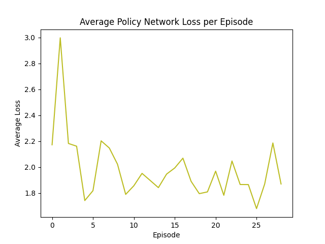
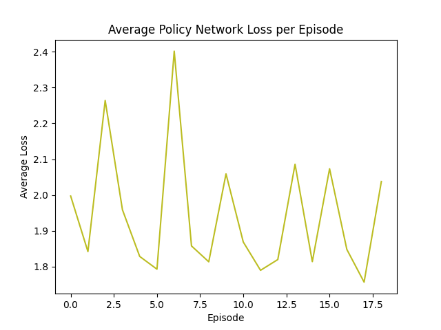
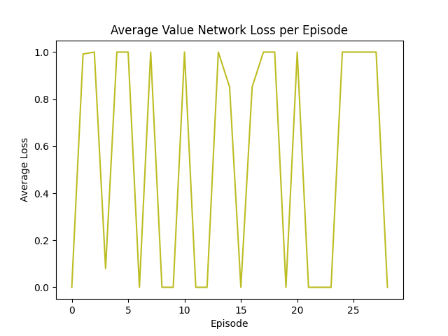
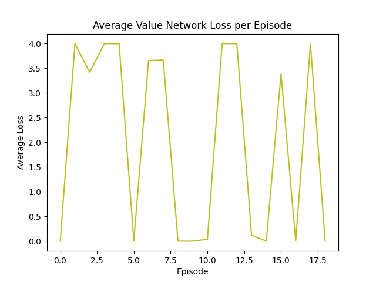
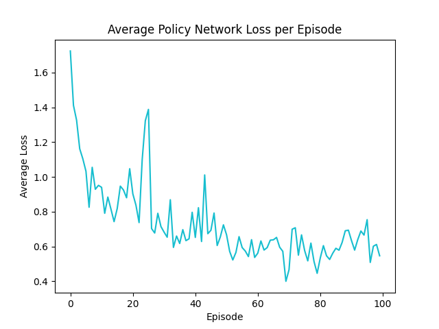
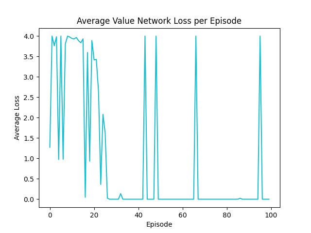
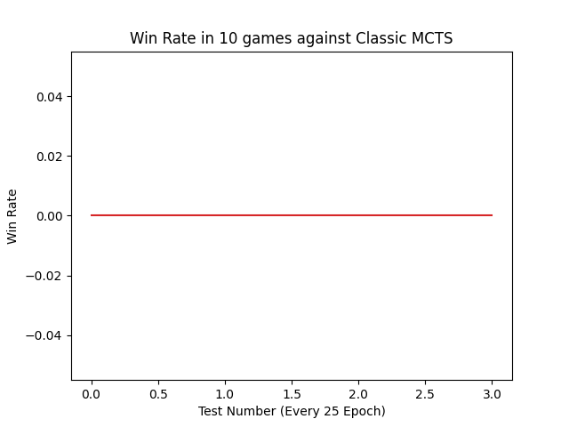
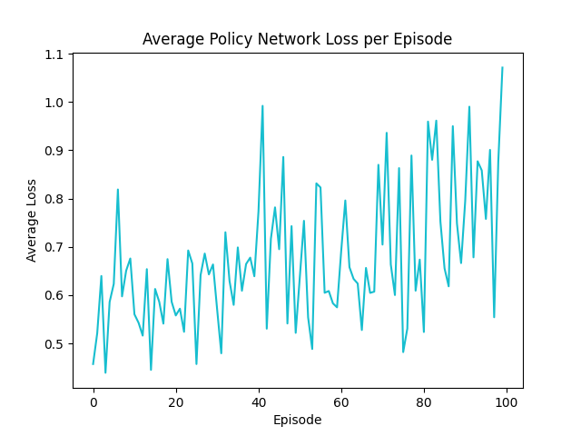
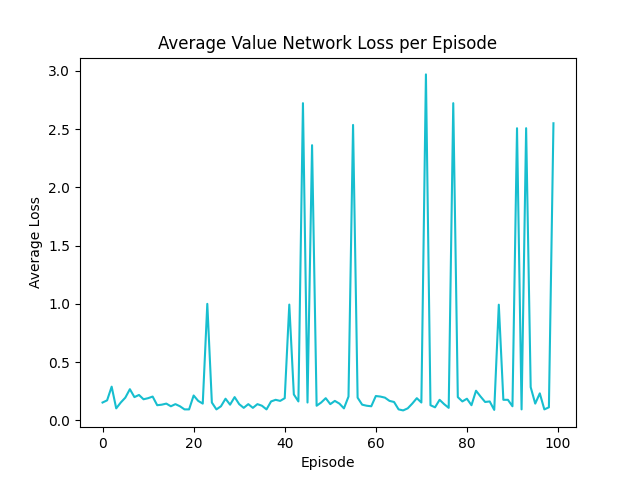
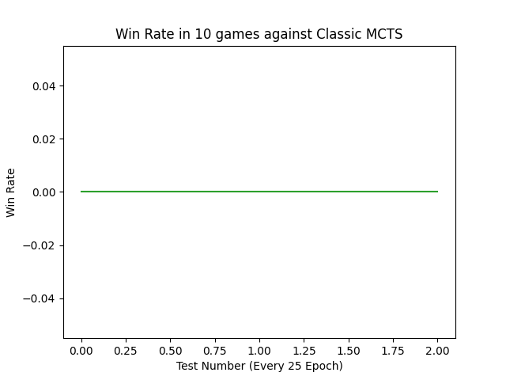

# Checkers Engine with AI

## Abstract objects:

### Board - represents checkers board and contains Fields

### Piece - represents all pieces with different colors and types

### Field - can contain Piece or None if there is no piece

### Position - has x and y value that represents position on the board

### Move - contains all positions that are taken during move (more than 2 in multi-capture move)

### Game - contains all logic behind the game:

- calculates all possible moves in current state
- calculates moves that are maximal in the sense of number of captures
- returns draw if no progress is made: during 25 consecutive moves there was no capture and man-type piece hasn't moved
- only kings ending counter management
- keeps history of the moves
- tracks whose turn is now
- checks whether game has already ended
- keeps zobrist hash of the current state of the board
- counts occurences of the same board state (must be less than 3) using zobrist algorith
- ensured after making move everything is updated
- returns evaluation (score) of current state of the board for desired side using only sum of the pieces' values:
  - KING 5 points
  - MAN 3 points
- returns final outcome of the game (who is winner or draw)
- returns 3D list that contains all information of the current state of the game and can be easily transformed into tensor
- returns list of start and end positions that represents space of all moves
- returns list that can be used to mask moves in the moves space that are not allowed by the engine in the current state

## Algorithms:

### Zobrist:

During initialization selects 3D tensor of random ints (for all fields every possible piece). Ints are from range $[0, 2^{64}]$ so that possibility of same value crash is low.
If each combination of position and piece yields different number (in binary representation at least one bit is different) then taking XOR of this numbers outputs unique hash for each state of the board. On binary level XOR works like addition with modulo 2. So XOR of the same number return 0. This property enables us to take piece from the position in constant time by adding it to the board the second time. Unique state also includes whose turn is now. This is managed by having unique number for this property and using XOR as described above.

### Minimax:

By using recursion and depth decrement tree of possible game states in explored. Above game engine is used so that only possible moves are calculated. As depth decreses maximizer and minimizer take turns (maximizer selects move that comes with the most positive score whereas minimizer does the opposite). When depth has decresed to 0 or game has ended then evaluation of board is returned. During unwinding the call stack function execution is resumed, best score from call is saved and another branch is explored.

### Alpha-Beta Pruning:

- Alpha is the best value that the maximizer currently can guarantee at that level or above.
- Beta is the best value (most negative) that the minimizer currently can guarantee at that level or below.

Pruning condition is: if at any point beta <= alpha, we can prune the remaining branches.  
Alpha and beta are passed from parent to children in the tree. And in this tree MAX and MIN take turns when another recursion call. So for example MIN parent
found so far pretty negative beta value that were returned from other children but these children were maximizing so if maximizing child found so far sth bigger than minimazing parent passed down in beta variable then maximizing child can stop further searching. It is because maximizing child cannot take sth less than he found already and what he found is already bigger than other maximizing child so it won't be selected by minimizing parent.

### Monte Carlo Tree Search:

Can be divided into 4 stages:

- Selection - traverses already build branches using UCB (Upper Confidence Bounds) selection rule
- Expansion - when the selection phase reaches a leaf node that isn't terminal, the algorithm expands the tree by adding one or more child nodes representing possible actions from that state
- Simulation - from the newly added node, a random playout is performed until reaching a terminal state. During this phase, moves are chosen randomly
- Backpropagation - the result of the simulation is propagated back up the tree to the root, updating statistics (visit counts and win rates) for all nodes visited during the selection phase

This stages are repeated iteratively until a computational limit is reached.

Upper Bound Confidence:  
For each action, calculate:

UCB = average reward + uncertainty term

The uncertainty term is higher when you haven’t tried that option much so there’s more room for surprise.

### Monte Carlo Tree Search with two neural networks 1.0:

Works in the same way as classic MCTS except:

- during simulation step moves are selected by the policy network with some probability so only "good" looking moves are checked
- during simulation step algorithm doesn't have to get to the final position if value network "thinks" that one player is already heavily better than the other

## Training process of Value Network and Policy Network 1.0:

MCTS plays against itself till the game is ended. During this process for every move: game state and moves' visits are recorded.
After the game has ended Policy Network is updated using recorded information. Value Network is updated based on the final outcome of the game.

## Training Graphs Version 1.0 Models:

### Policy Network:

#### 0-30 EPOCHS:

#### 30-50 EPOCHS:

### Value Network:

#### 0-30 EPOCHS:

#### 30-50 EPOCHS:

## Monte Carlo Tree Search with two neural networks 2.0:

Works similarly to AlphaZero-style MCTS:

 - policy network guides tree exploration using PUCT and prior probabilities for moves
 - value network evaluates positions directly so there is no random rollout simulation to the end of the game
 - all legal children of expanded node are created at once and assigned prior probabilities from the policy network
 - node selection balances:
exploitation (average estimated value of the node)
exploration (policy prior and visit counts)
 - during self-play Dirichlet noise is added to the root node probabilities to improve opening exploration
 - move selection during training uses temperature parameter τ to control exploration randomness

## Training process of Value Network and Policy Network 2.0:

MCTS plays games against itself using policy-guided tree search and value evaluation.

## Training Graphs Version 2.0 Models:

### Policy Network:

#### 0-100 EPOCHS:

### Value Network:

#### 0-100 EPOCH:

#### Win Rate Against Classic MCTS Given Same Amount of Time To Move

## Training process of Value Network and Policy Network 2.1:

Early-game positions are evaluated closer to neutral.

## Training Graphs Version 2.1 Models:

### Policy Network:

#### 0-100 EPOCHS:

### Value Network:

#### 0-100 EPOCH:

#### Win Rate Against Classic MCTS Given Same Amount of Time To Move

## Pre-trained models:

When there is no ValueNetwork.pt and PolicyNetwork.pt files in the models/X/ folder then they are automatically downloaded from the google drive using hardcoded url.

## Parallelizing self-play:
Self-play matches are played in parallel to speed up generating training data using pytorch multiprocessing.

## Training interface:

## How to use:

Usage of the engine and all playing algorithms is presented in the main.py file.
